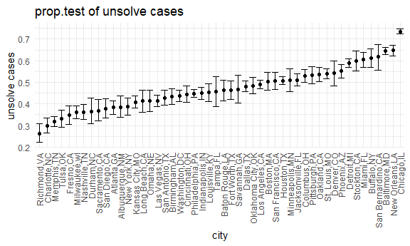
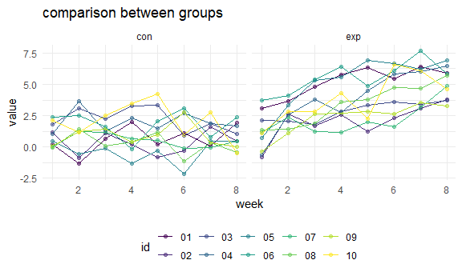

Homework5
================
Paulina Han
2021/11/13

``` r
library(tidyverse)
```

    ## -- Attaching packages --------------------------------------- tidyverse 1.3.1 --

    ## v ggplot2 3.3.5     v purrr   0.3.4
    ## v tibble  3.1.5     v dplyr   1.0.7
    ## v tidyr   1.1.4     v stringr 1.4.0
    ## v readr   2.0.2     v forcats 0.5.1

    ## -- Conflicts ------------------------------------------ tidyverse_conflicts() --
    ## x dplyr::filter() masks stats::filter()
    ## x dplyr::lag()    masks stats::lag()

``` r
library(rvest)
```

    ## 
    ## 载入程辑包：'rvest'

    ## The following object is masked from 'package:readr':
    ## 
    ##     guess_encoding

``` r
library(httr)
```

``` r
knitr::opts_chunk$set(
  fig.width = 6,
  fig.asp = .6,
  out.width = "90%"
)
theme_set(theme_minimal() + theme(legend.position = "bottom"))
options(
  ggplot2.continuous.colour = "viridis",
  ggplot2.continuous.fill = "viridis"
)
scale_colour_discrete = scale_color_viridis_d
scale_fill_discrete = scale_fill_viridis_d
```

# Problem 1

``` r
# read the data
url_1 = "https://raw.githubusercontent.com/washingtonpost/data-homicides/master/homicide-data.csv"

df_raw = read_csv(url(url_1),na = c("","Unknown")) #age should be numeric,unknown should be na
```

    ## Rows: 52179 Columns: 12

    ## -- Column specification --------------------------------------------------------
    ## Delimiter: ","
    ## chr (8): uid, victim_last, victim_first, victim_race, victim_sex, city, stat...
    ## dbl (4): reported_date, victim_age, lat, lon

    ## 
    ## i Use `spec()` to retrieve the full column specification for this data.
    ## i Specify the column types or set `show_col_types = FALSE` to quiet this message.

``` r
# #create a city_state variable
# df = 
#   df %>% 
#   mutate(
#     city = as.factor(city),
#     city_state = as.factor(paste(city, state, sep=",")))%>%  #use #mutate(city_state = str_c(city,state))
#   relocate(city_state) %>% 
#   filter(city_state != "Tulsa_AL")

#Jeff's version(use case when)
df = 
  df_raw %>% 
  mutate(
    city_state = str_c(city,state, sep=","),
    resolution = case_when(
      disposition == "Closed without arrest" ~ "unsolved",
      disposition == "Open/No arrest" ~"unsolved",
      disposition == "Closed by arrest" ~"solved"
    )
  ) %>% 
  relocate(city_state) %>% 
   filter(city_state != "Tulsa,AL")

#resolution of crimes
df_summary = df %>% 
  group_by(city_state) %>% 
  summarize(
    unsolved = sum(resolution == "unsolved"),
    n=n()
  )
```

The Washington Post data on homicides in 50 large US cities contains
52179rows and 12variables, with uid, reported\_date, victim\_last,
victim\_first, victim\_race, victim\_age, victim\_sex, city, state, lat,
lon, disposition.

Lets focus on Baltimore

``` r
baltimore_df = 
  df %>% 
  filter(city_state == "Baltimore,MD")

baltimore_summary = 
  baltimore_df %>% 
  summarize(
    unsolved = sum(resolution == "unsolved"),
    n = n()
  )

baltimore_test = 
  prop.test(
  x = baltimore_summary %>% pull(unsolved),
  n = baltimore_summary %>% pull(n)
)

baltimore_test %>% 
  broom::tidy()
```

    ## # A tibble: 1 x 8
    ##   estimate statistic  p.value parameter conf.low conf.high method    alternative
    ##      <dbl>     <dbl>    <dbl>     <int>    <dbl>     <dbl> <chr>     <chr>      
    ## 1    0.646      239. 6.46e-54         1    0.628     0.663 1-sample~ two.sided

try to iterate

``` r
#Create result_df
result_df =
  df_summary %>% 
  mutate(
    test_results = map2(unsolved,n,prop.test),
    tidy_results = map(test_results,broom::tidy)
  ) %>% 
  select(city_state,tidy_results) %>% 
  unnest(tidy_results) %>% 
  select(city_state,estimate,starts_with("conf"))

#plot the result
result_df %>%  
mutate(city_state = fct_reorder(city_state, estimate)) %>% 
  ggplot(aes(x = city_state, y = estimate)) +
  geom_point() + 
  geom_errorbar(aes(ymin = conf.low, ymax = conf.high)) +
  labs(
    title = "prop.test of unsolve cases",
    x = "city",
    y = "unsolve cases",
    ) +
  theme(axis.text.x = element_text(angle = 90, vjust = 0.5, hjust = 1))
```



# Problem 2

``` r
#list.files(path ="data/.")

dat_path = str_c("data/",list.files(path ="data/."))

lgt_df = 
  tibble(
  obs = list.files(path ="data/.")
) %>% 
  mutate(
    data = purrr::map(dat_path,read_csv)
  ) %>% 
  unnest(data) %>% 
  separate(obs,into = c("arm","id","file")) %>% 
  select(-file) %>% 
   pivot_longer(
    week_1:week_8,
    names_to = "week",
    names_prefix = "week_",
    values_to = "value"
  ) %>% 
  mutate(week = as.numeric(week))
  
#make a plot
lgt_df %>% 
 ggplot(aes(x = week, y = value, color =id))+
   facet_grid(. ~ arm)+
   geom_point(alpha = 0.5) +
  geom_line()+
   labs(
    title = "comparison between groups",
    x = "week",
    y = "value",
    )
```



We can see from the plot that the value observed increased with time.
The experiment group tends to have higher value than the control group.

# Problem 3

``` r
set.seed(10)

iris_with_missing = iris %>% 
  map_df(~replace(.x, sample(1:150, 20), NA)) %>%
  mutate(Species = as.character(Species))

#create a function
missing_replace = function(x) {
 
  if(is.numeric(x)){
   x =  replace_na(x,mean(x,na.rm = T ))
    }
  else if(is.character(x)){
    x =replace_na(x,"virginica")
  }
}

#apply function to missing data set
iris_with_replace=map(iris_with_missing, missing_replace)
```
